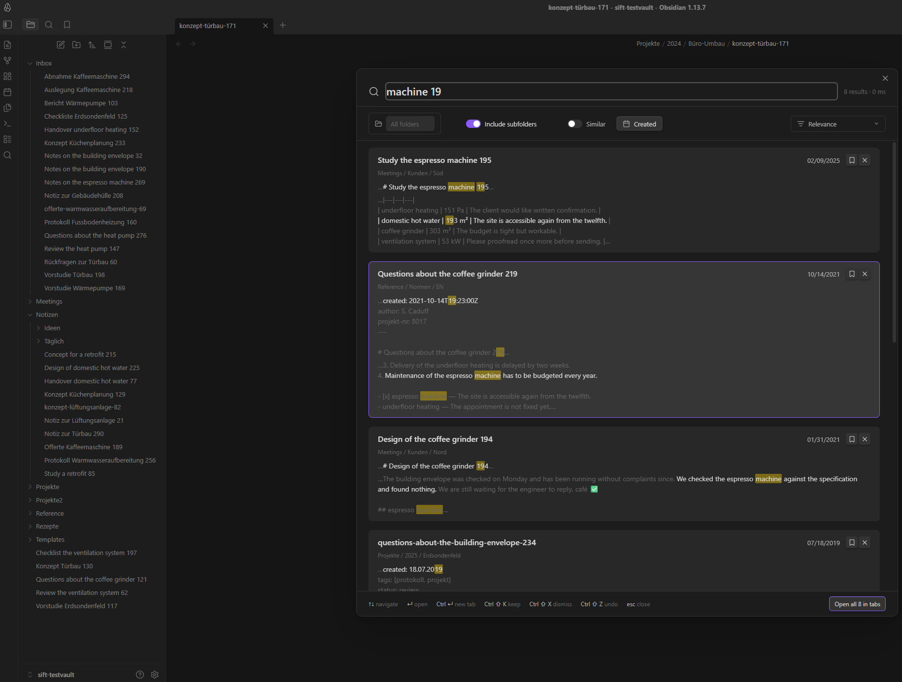
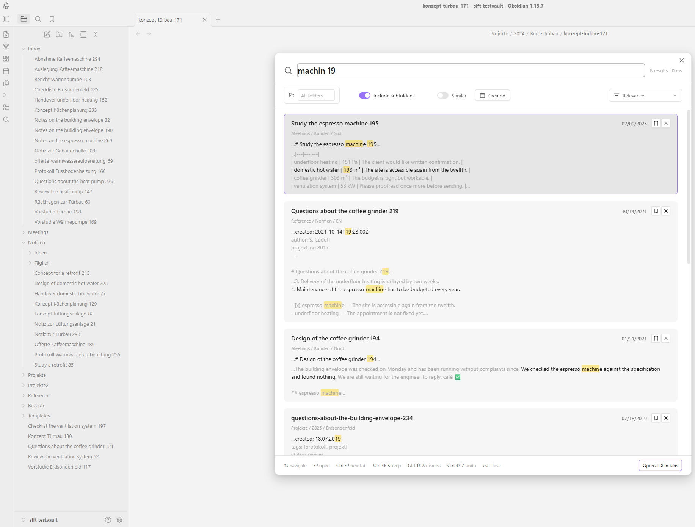
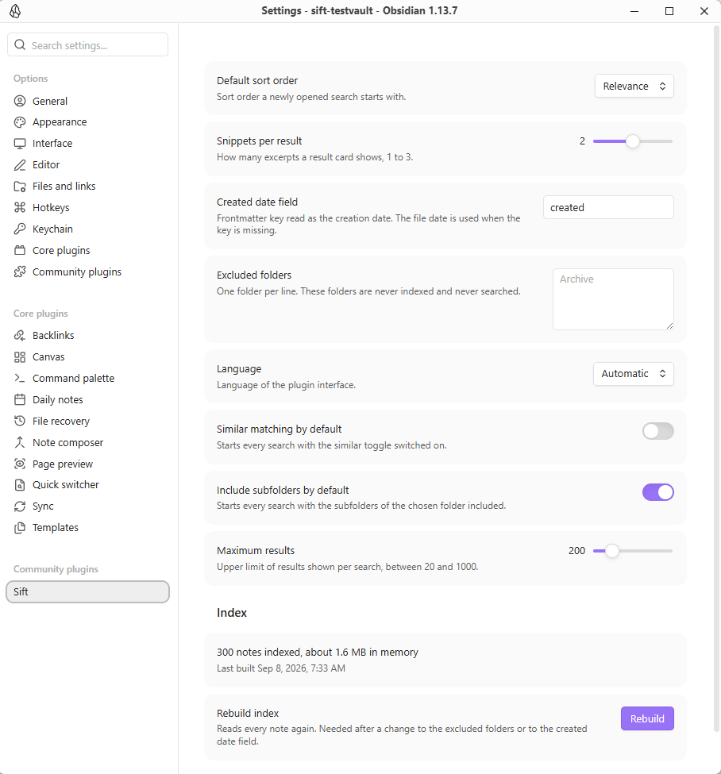

# Sift

Search your notes with substring matching, operators, path and date filters, and ranked results in a large overlay.

Sift is a community plugin for Obsidian. It keeps a local index of your Markdown notes and matches *inside* words, not only at their beginning: typing `maschine` finds a note about the `Espressomaschine`, and typing `kueche` finds a note that spells it `Küche`. Results open in a wide, keyboard-driven overlay with excerpts around every hit.

Everything runs on your device. Sift makes no network requests at all — see [Privacy and network use](#privacy-and-network-use).

## Screenshots

The search overlay in a dark theme: the query matches inside words, and every card carries excerpts cut from the note itself, with the hits highlighted.



The same overlay in a light theme. Sift hardcodes no colour; every surface, border and highlight comes from the Obsidian theme variables, so it follows whatever theme you use.



The settings tab. It reports how many notes are indexed and how much memory the index occupies, and rebuilds the index on demand.



## What it does

- **Substring (infix) matching.** The index is built from trigrams, so a term matches anywhere inside a word. `maschine` finds `Espressomaschine`; `sonde` finds `Erdsondenfeld`. Prefix-only search engines cannot do this.
- **Umlaut and ß tolerance in both directions.** `kueche` finds `Küche`, `küche` finds `Kueche`, `strasse` finds `Straße`. Such a hit is marked as an alias match and ranks just below a literal one.
- **Operators.** Spaces mean AND, `"quoted text"` is an exact phrase, `-word` excludes, `a OR b` accepts either.
- **Field prefixes.** `path:`, `tag:` and `title:` limit a single term to that field.
- **Path and date filters.** Restrict a search to one folder, with or without its subfolders, and to a created or modified date range, with quick picks for the last 7 days, 30 days and year.
- **Ranked results.** Hits in the title, in frontmatter, in a tag and in a heading count for more than hits in the body; several matching terms close together count for more than the same terms far apart; whole-word matches get a bonus and recently edited notes a small one. The result is shown as a relevance value from 0 to 100. The order can be switched to created, modified, title or path at any time.
- **Excerpts with highlighted hits.** Every card shows up to three excerpts of about 160 characters, cut from the original note text, so umlauts, casing and Markdown look exactly as you wrote them. The sentence around the hit is rendered in the normal text colour, its surroundings muted.
- **Keyboard-first overlay.** Open, type, navigate and open a note without touching the mouse. Opening a hit places the cursor on the exact match position in the note.
- **Optional typo tolerance.** The "Similar" toggle also accepts close spellings — `Espresomaschine` and `Kafeemaschine` still find the espresso machine note. It is off by default, never applies inside a phrase, and a card found this way says which word it actually matched.
- **English and German interface.** The language follows the Obsidian interface language and can be set explicitly.

## How to use

Open the command palette and run **Sift: Open search**, or click the ribbon icon.

Sift deliberately registers **no default hotkey**, so it cannot collide with your own bindings or with another plugin. Assign one yourself under `Settings → Hotkeys` and search for "Sift".

### Keyboard

| Key | Action |
| --- | --- |
| Type | Search runs automatically, about a tenth of a second after you stop typing |
| `↑` / `↓` | Move through the results |
| `Enter` | Open the selected note in the current tab, cursor on the match |
| `Ctrl` + `Enter` (`Cmd` + `Enter` on macOS) | Open the selected note in a new tab |
| `Tab` | Move from the search field into the filter bar |
| `Esc` | Close the overlay |

### Search syntax

| Query | Meaning |
| --- | --- |
| `wärmepumpe altbau` | Both terms must occur, anywhere in the note |
| `"wärmepumpe im altbau"` | The exact phrase, spaces included |
| `wärmepumpe -altbau` | Contains the first term, does not contain the second |
| `wärmepumpe OR erdsonde` | At least one of the two |
| `path:Projekte kessel` | `kessel` anywhere, and `Projekte` in the note's path |
| `tag:hlks lüftung` | Notes tagged `hlks` that contain `lüftung` |
| `title:küche` | The term has to occur in the note title |

Two details worth knowing, because they follow from substring matching:

- Exclusion is a substring test too. `-altbau` also removes a note that only contains `Altbauwohnung`.
- A malformed query never fails. An unclosed quotation mark, a dangling `-` or an unknown `foo:` prefix is reported next to the search field, and Sift searches the part of the query it could read.

### Filter bar

The chip row under the search field holds:

- **Folder** — pick one folder; the search is limited to it. "Include subfolders" decides whether notes further down count.
- **Created** and **Modified** — a date range with quick picks for the last 7 days, 30 days and year. The created date is read from your frontmatter date field where present, otherwise from the file itself.
- **Similar** — the typo tolerance described above.
- **Sort** — relevance, created, modified, title or path.
- The hit counter on the right shows how many notes matched and how long the search took.

Each chip can be removed individually; nothing is remembered between two searches except what you set in the settings.

## Settings

| Setting | What it does |
| --- | --- |
| Default sort order | Sort order a newly opened search starts with. |
| Snippets per result | How many excerpts a result card shows, 1 to 3. |
| Created date field | Frontmatter key read as the creation date; the file date is used when the key is missing. |
| Excluded folders | One folder per line. These folders are never indexed and never searched. |
| Language | Interface language: automatic, English or German. |
| Similar matching by default | Starts every search with the "Similar" toggle switched on. |
| Include subfolders by default | Starts every search with the subfolders of the chosen folder included. |
| Maximum results | Upper limit of results shown per search. |
| Rebuild index | Reads every note again. Needed after changing the excluded folders or the created date field. The settings tab also shows how many notes are indexed and roughly how much memory the index uses. |

## Privacy and network use

- **Sift makes no network requests.** There is no `fetch`, no `XMLHttpRequest`, no `WebSocket`, no `requestUrl` and no `sendBeacon` anywhere in `src/` or in the shipped `main.js`. The plugin has no remote counterpart of any kind. (The static mockups under `docs/` and the development preview under `dev/` load a web font when you open them in a browser. Neither is part of the plugin and neither is ever loaded by it.)
- **Sift collects no telemetry.** No analytics, no crash reporting, no usage counters, no ping on startup. Your search terms are never logged — not to a file, not to the developer console.
- **Which files Sift looks at.** Building an index means knowing which notes exist, so Sift asks Obsidian for the list of Markdown files in the vault and reads each one once. Folders you exclude in the settings are skipped, and non-Markdown files are never opened. Nothing about that list is stored anywhere but the local index, and nothing is sent anywhere.
- **Your note content never leaves your device.** Reading, indexing, searching and building excerpts all happen inside Obsidian.
- **Where the index lives.** Sift stores its index in the browser's IndexedDB inside Obsidian's own app storage for that vault, keyed by the vault id, so two vaults on the same machine never share an index. Nothing is written into your vault itself except the plugin's own `data.json`, which holds your settings and nothing else. The index is derived data: "Rebuild index" in the settings discards it and reads your notes again, and a stored index is thrown away automatically when it no longer matches the vault or your settings.
- **Nothing outside the vault is read.** Sift uses the Obsidian vault API only, no file-system, Node or Electron API, which is also why it runs on mobile.

## Performance

The index is built once per vault and then kept up to date incrementally: creating, editing, renaming or deleting a note re-reads that one note, not the vault. Indexing runs in small slices during idle time, so the interface never freezes, and the search overlay stays usable while it is still running.

Measured with `npm run bench` against the generated 10 000-note test vault, median of three runs, on one desktop workstation — an Intel Core i9-13900K, 64 GB of memory, Node 22 on Windows 11. Your own machine will differ; a laptop on battery differs a lot.

| What | Measured | Target |
| --- | --- | --- |
| Cold index of 10 000 notes | 1.97 s | under 5 s |
| Warm start from the stored index | 1.22 s | — |
| Index memory for 10 000 notes | 50.9 MB | under 100 MB |
| Re-index one changed note | 114 ms | — |
| Slowest of 34 search shapes | 43.4 ms | under 100 ms |

The search figure is the p95 of the slowest of 34 query shapes the benchmark runs — single terms, infix terms, two- and three-term queries, phrases, exclusions, OR groups, the `path:`, `title:` and `tag:` prefixes, umlaut and ASCII-alias spellings, two-character terms, folder and date filters, filter-only searches and two sort orders. All 34 stay under 62 ms. The slowest is `wärmepumpe OR erdsondenfeld OR lüftungsanlage`, which matches 6 101 of the 10 000 notes and therefore has to rank most of the vault.

**Typo tolerance costs more, and is off by default.** With "Similar" on, the same 34 shapes range from 1.8 ms to 214 ms, and nine of them pass 100 ms. That mode compares the query against the words of every candidate note, so the work grows with how much of the vault a term can plausibly reach; the budget for it is 500 ms rather than 100 ms, and it is a switch you throw when an exact search came back empty.

The 10 000-note run is the release gate and has to be repeated before a release. Continuous integration runs the same benchmark at 2 000 notes, where a hosted runner can afford it, against budgets loose enough that only an order-of-magnitude regression fails — a shared two-core runner cannot be held to a workstation's numbers, but it can catch a linear scan that turned quadratic.

## Compatibility

- Desktop and mobile. `isDesktopOnly` is `false`; there is no platform-specific code.
- Minimum Obsidian version: **1.8.7** (see `manifest.json`).
- Themes: Sift uses only Obsidian's own CSS variables, so it follows your theme in both light and dark mode.

## Installation

From inside Obsidian, once the plugin is listed: `Settings → Community plugins → Browse`, search for "Sift", install and enable it.

To install a build manually, copy `main.js`, `manifest.json` and `styles.css` into `<your vault>/.obsidian/plugins/sift/` and enable the plugin under `Settings → Community plugins`.

## Development

```
npm install                            # install the build toolchain
npm run fixtures -- --count 2000       # generate the test vault, once after cloning
npm run dev                            # watch build into main.js
npm run build                          # type-check and production build
npm test                               # unit tests (Vitest)
npm run bench                          # benchmark index build and search against that vault
npm run guard                          # scan the source for store-policy violations
npm run check                          # guard + typecheck + lint + test
```

**Generate the test vault before the first `npm test`.** It is git-ignored, so a fresh clone has none, and the Searcher, fuzzy and filter suites read it. `test/fixture-vault.test.ts` is the gate in front of them: it fails first and prints the command above. 2 000 notes is what the suite is written for; the generator is seeded, so a larger vault is a superset and works too. Continuous integration generates the same 2 000 notes before it runs the tests.

**Run `npm run check` before every commit.** It is the same gate the project uses for a release: the policy scan, the TypeScript type check, ESLint (including `eslint-plugin-obsidianmd`) and the full test suite. A commit is expected to build and to leave the test suite green.

A few conventions, so a patch does not bounce:

- Code, comments, identifiers and commit messages are written in English, even though the plugin ships a German interface.
- Every user-visible string goes through `src/i18n/` and is written in sentence case. `en.json` and `de.json` must carry exactly the same key set, and no interface file may write text of its own; `test/i18n.test.ts` enforces the first and `test/i18n-callsites.test.ts` the second.
- DOM is built with `createEl()`, `createDiv()` and `setText()`. `innerHTML` and its relatives are not used anywhere.
- No hardcoded colours. Every own CSS class starts with `sift-`.
- Changes to the parser, the searcher or the ranker need a unit test.
- `main.js` is a build artefact, is git-ignored, and ships only as a release asset.

`test/fixtures/vault` is generated, never edited by hand: it holds German and English notes with compound words, umlauts, frontmatter dates and nested folders, which is what the offset and folding tests are built on.

## Reporting a bug

Please open an issue using the bug report form. It deliberately does not ask for the content of your notes, and you should not paste any: a description of the query shape (for example "a two-word query with an umlaut in the second word") is enough to reproduce almost everything. If you attach console output, remove note titles and paths from it first.

## Contributing

Issues and pull requests are welcome. [CONTRIBUTING.md](CONTRIBUTING.md) has the setup, the house rules and what a patch needs in order to be merged, and [CODE_OF_CONDUCT.md](CODE_OF_CONDUCT.md) applies to every space of this project. For a suspected security problem, do not open an issue — follow [SECURITY.md](SECURITY.md) instead.

## Licence

MIT — see [LICENSE](LICENSE).
